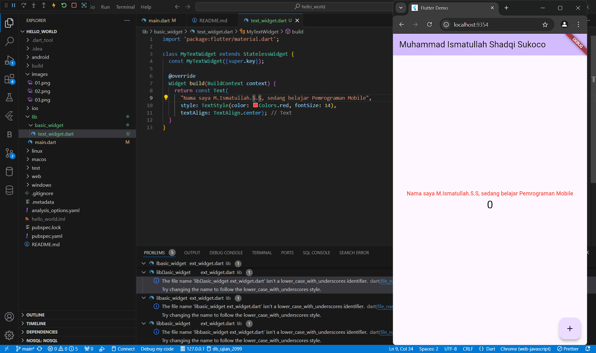
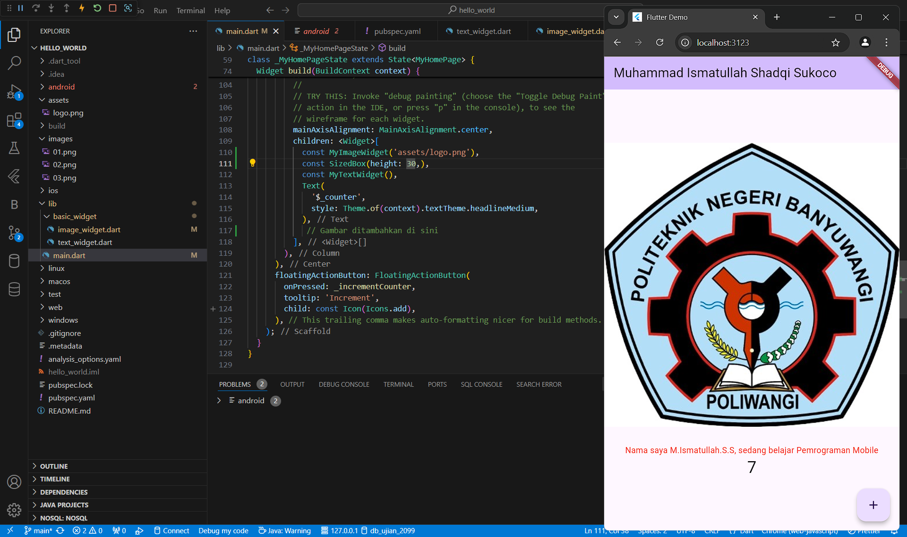
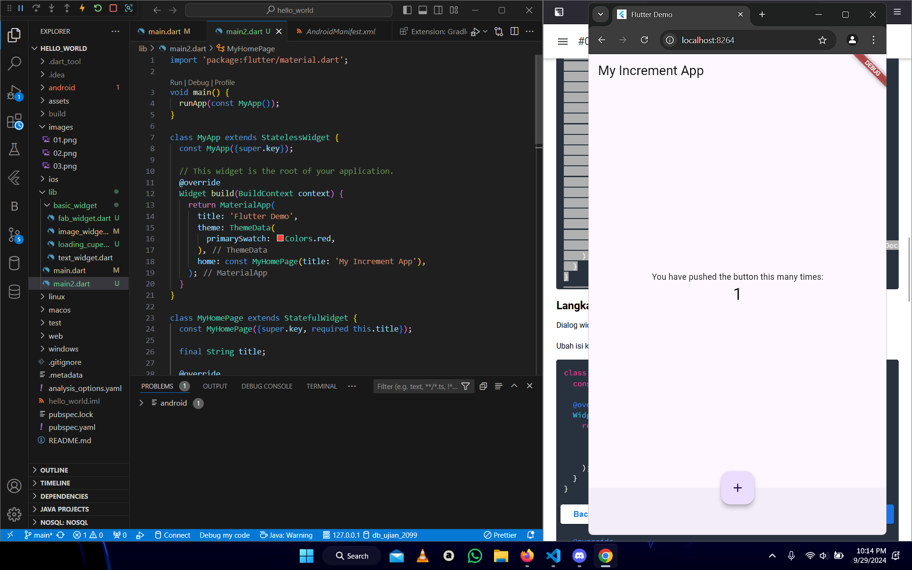

# hello_world

A new Flutter project.

praktikum 1 :
pada praktikum 1 ini kita membuat project flutter baru dengan memilih jenis project nya, dan memilih membuat folder simpan di local
praktikum 2 :
pada praktikum 2 kita diharuskan untuk login ke github agar dapat melakukan commit dan membuat repo baru, lalu menjalankan command 'git init', lalu kita mengunggah file pertama kedalam repo github dan menambahkan pesan commit, lalu lakukan push dan menambah remote.
praktikum 3 :
pada praktikum 3 ini kita menambahkan fungsi-fungis kedalam file main.dart dan file lainnya, disini kita menerapkan widget dasar
praktikum 4 :
pada praktikum 4 kita Menerapkan Widget Material Design dan iOS Cupertino(Cupertino Button dan Loading Bar, Floating Action Button (FAB), Scaffold Widget, Dialog Widget, Input dan Selection Widget, Date and Time Pickers)

## Getting Started

This project is a starting point for a Flutter application.

A few resources to get you started if this is your first Flutter project:

- [Lab: Write your first Flutter app](https://docs.flutter.dev/get-started/codelab)
- [Cookbook: Useful Flutter samples](https://docs.flutter.dev/cookbook)

For help getting started with Flutter development, view the
[online documentation](https://docs.flutter.dev/), which offers tutorials,
samples, guidance on mobile development, and a full API reference.
